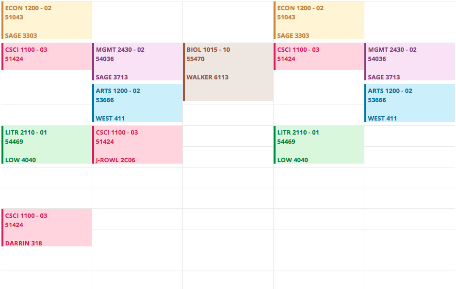

<h1 class="logo"><small>beta</small></h1>

<h2>the free, open source course scheduler</h2>

* created by rcos at rpi
  

[GitHub](https://github.com/yacs-rcos)
[RCOS](https://rcos.io)

<!-- background image -->

